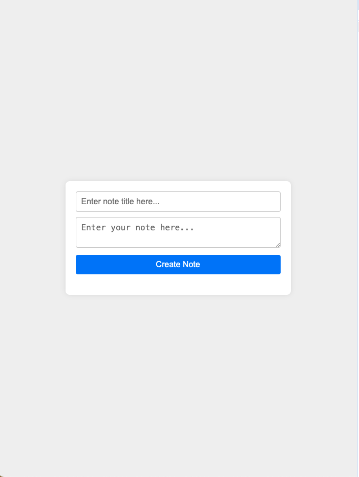
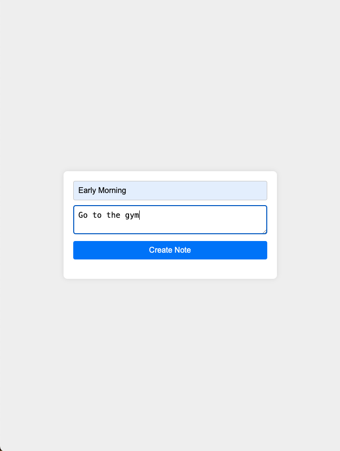
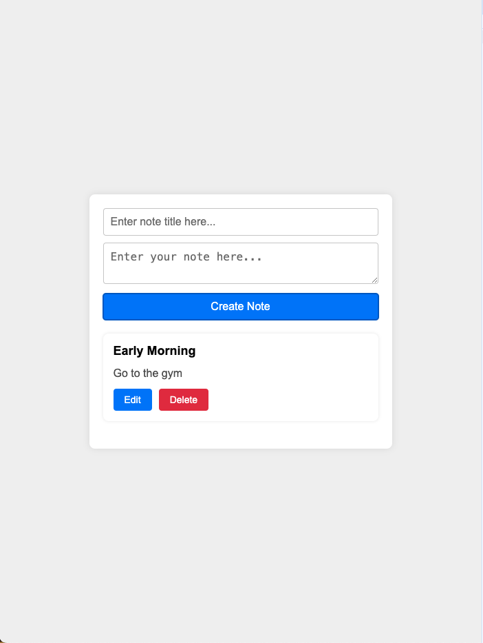
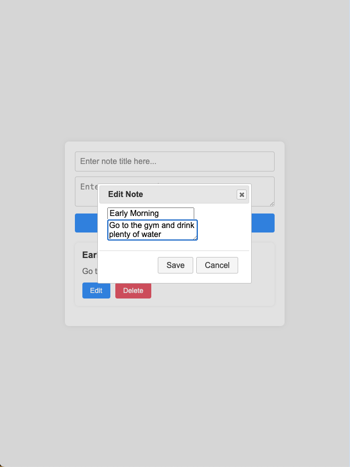
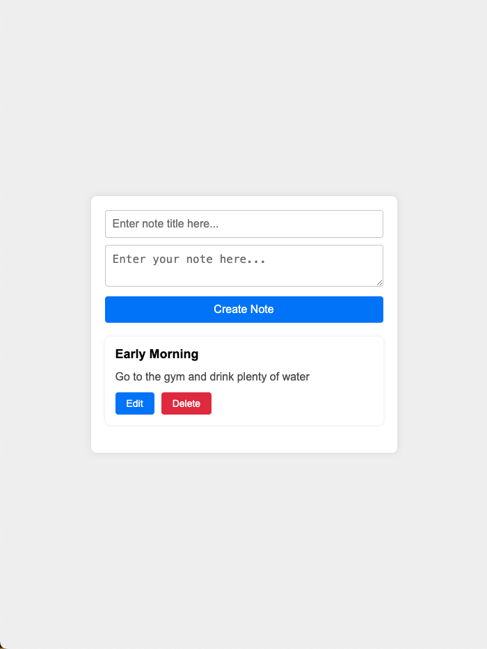
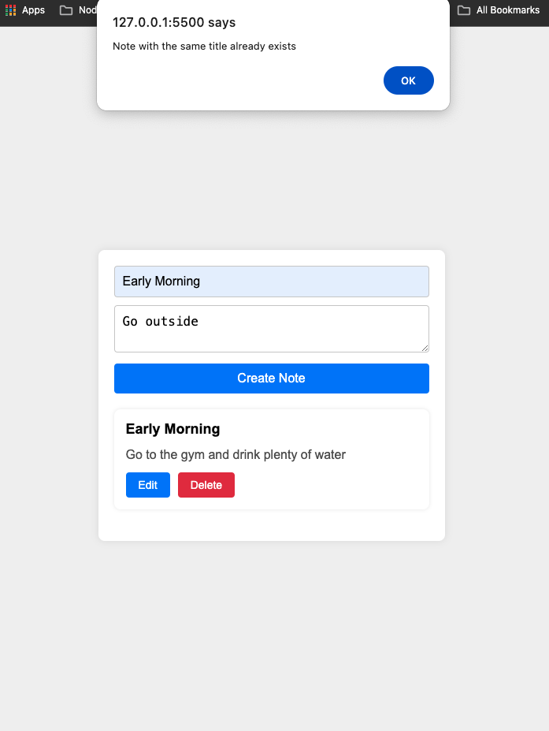
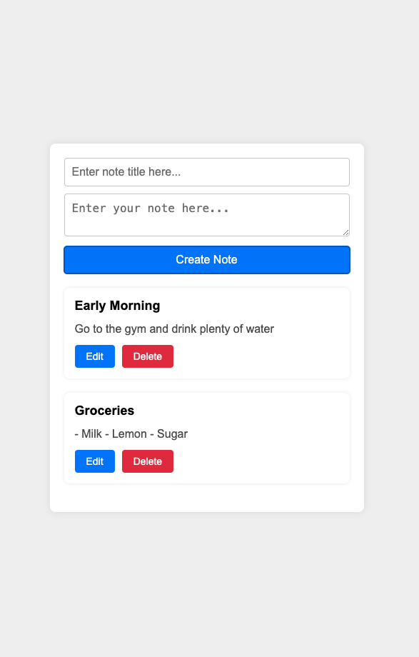
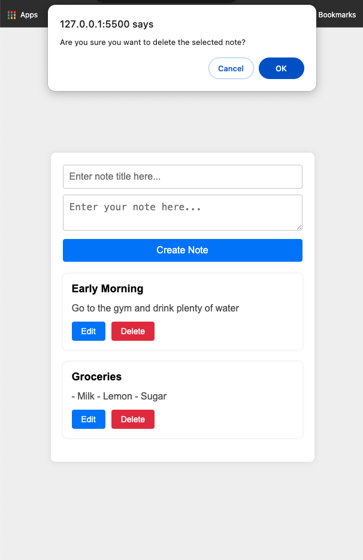
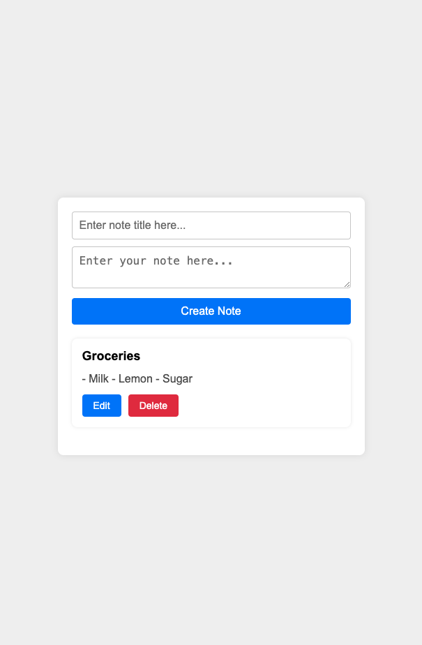

# Creating a secure note taking app
 ## This app is created using html, css, jquery and jquery ui
- this app is capable for creating, modifying and deleting notes securely
- keeps track of the notes through local storage in the browser
- data are stored in the json format
- Notes with same title are not allowed

## Here are the results

## Future Enhancements
- Create a login 
- Store the notes to the database
- Add enryption to the notes
- Add customizable text areas to include heading, list, numbers and different colours
- Customize notes according to the priority like red is top most priority
- Add page to view the history of the completed notes

